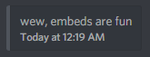

# Sending Embeds

## Basic Usage

Currently the standard way to send embeds is to execute the `embed` or `advancedembed` command through a variable.

### Input

```json
{a!embed;wew, embeds are fun}
```

⚠️ Warning: Do not use your server's prefix. Command variables **do not** support custom prefixes. They will only with with `a!`.

### Output



Possible uses for this could be custom join/leave messages by using a non-embedded message and using the `{a!embed}` variable to send your own embed, or having your own super fancy custom commands.

## Advanced Usage

You can do a lot more than just a simple embed. You can view all the possible options by doing `a!help advancedembed` in your server, but there are tons of options available. For example, if you wanted to embed level up messages, you could do:

### Input

```json
{a!advancedembed;--title="Level Up!";--description="Congratulations {mention.user}, you have levelled up to level {user.level}!";--thumbnail="{user.avatarURL}"}
```

### Output


You can take this a lot further, for example you could add `--color="#3AAFA9"` to make the bar on the left of the embed a different color, where `#3AAFA9` can be any hex code, or a color name like `blue`. You could add more fields, add an image or URL, and a lot more. The syntax for `advancedembed` isn't the best at the moment, but it gets the job done.
